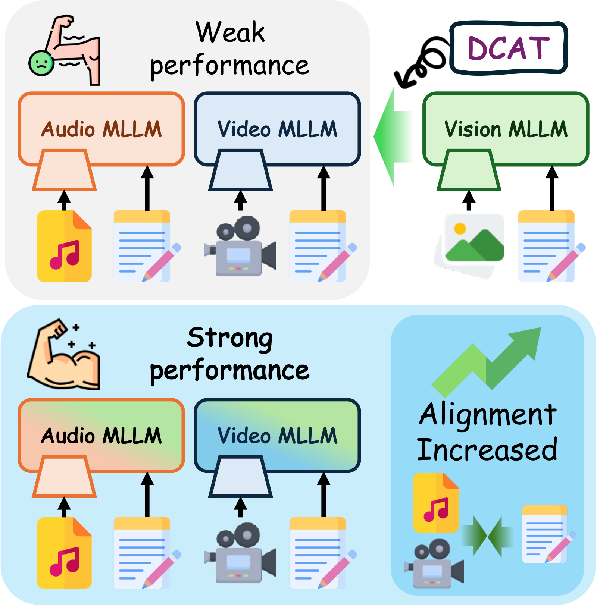
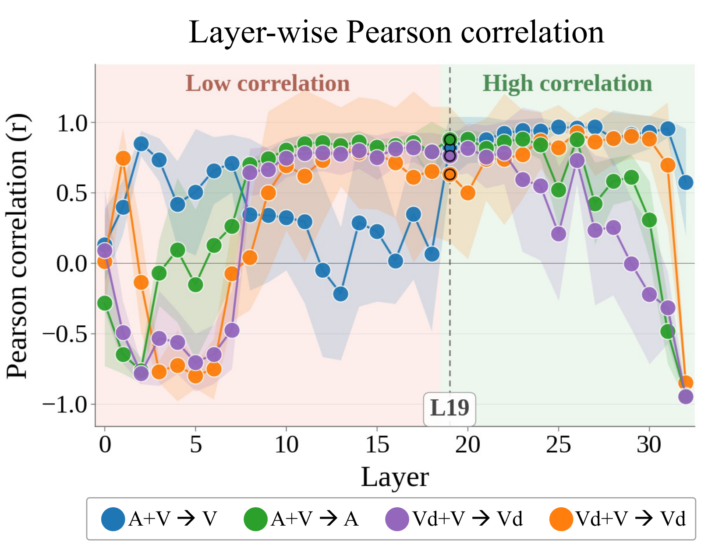

<div align="center">

# Strong Helps Weak: Directional Cross-Modal Alignment Transfer in Multi-modal LLMs

### NeurIPS 2026 (Spotlight)

**Hoigi Seo**<sup>1\*</sup> &nbsp;&nbsp; **Byung Hyun Lee**<sup>1\*</sup> &nbsp;&nbsp; **Minjun Kim**<sup>1\*</sup> &nbsp;&nbsp; **Dohyun Mah**<sup>1</sup> &nbsp;&nbsp; **Jongho Lee**<sup>2</sup> &nbsp;&nbsp; **Se Young Chun**<sup>1,2†</sup>

<sup>1</sup>Dept. of ECE &nbsp;&nbsp; <sup>2</sup>IPAI & INMC, Seoul National University, Republic of Korea

<sub>\* Equal contribution &nbsp;&nbsp; † Corresponding author</sub>

[](#citation)
[](https://www.python.org/)
[](https://pytorch.org/)
[](#method)

</div>

<p align="center">
  
</p>

**DCAT** transfers alignment from a strong, well-aligned **donor**-modality MLLM (vision) into a
weaker **recipient**-modality MLLM (audio / video), improving the recipient on its *own* benchmarks —
no fine-tuning, no gradients, only a few hundred unlabeled calibration samples and one closed-form
solve per projection.

---

## Method

Merging a vision MLLM into an audio MLLM makes the audio model better *at audio*. The reason is
**alignment**: how much modality-token energy sits inside the LLM's principal text subspace
(**SEO**), and how evenly it spreads across that subspace (**SD**). The paper proves a
mutual-information lower bound that is monotonic in their product — the **Alignment score** — and
shows it correlates strongly with downstream accuracy, most clearly from the middle layers onward.

<p align="center">
  
</p>

DCAT optimizes that quantity directly. Per linear projection it solves

$$\min_{\tau} \underbrace{\lVert X_{\text{mod}}(\theta_0+\tau)-T_\alpha\rVert_F^2}_{\text{self-alignment}} + \eta\cdot\underbrace{\Big(\beta\lVert X_{\text{text}}(\tau-\tau_r)\rVert_F^2+(1-\beta)\lVert X_{\text{text}}(\tau-\tau_d)\rVert_F^2\Big)}_{\text{cross-modal alignment}}$$

where $\tau_r,\tau_d$ are the recipient and donor task vectors and $T_\alpha$ is a norm-preserving
target built inside the text subspace with a rebalanced spectrum. The first term raises SEO and SD;
the second anchors the update between recipient and donor on text inputs, which is how the donor's
alignment actually gets transferred.

---

## Installation

Two environments: Vicuna runs on **ModelCompose**, LLaMA 3.1 on **LLaVA-NeXT + Ultravox**. They are
not co-installable.

```bash
# Vicuna
conda create -n dcat_vicuna python=3.10 -y && conda activate dcat_vicuna
pip install -r requirements_vicuna.txt
git clone https://github.com/WalkerWorldPeace/MLLMerging.git
cd MLLMerging/ModelCompose && pip install -e . && cd -

# LLaMA 3.1
conda create -n dcat_llama python=3.10 -y && conda activate dcat_llama
pip install -r requirements_llama.txt
pip install git+https://github.com/LLaVA-VL/LLaVA-NeXT.git
```

One GPU with ≥ 24 GB VRAM. Merging peaks at ≤ 17 GB and takes 24–35 min on an L40S 48GB.

Calibration uses **AVQA** (256 samples, audio track for audio recipients, video track for video
recipients); evaluation uses **MMAU** for audio and **Video-MME** for video. Vicuna checkpoints follow
the [OptMerge](https://github.com/EnnengYang/OptMerge) release; the LLaMA 3.1 models are independently
trained in-the-wild checkpoints that merely share the backbone.

---

## Running

Absolute paths ship as the placeholder `xxx/xxx`. Replace them, and set your conda env name, first:

```bash
ROOT=/your/actual/root        # parent of the checkpoint and data directories
find . -type f \( -name '*.sh' -o -name '*.py' \) -exec sed -i "s|xxx/xxx|$ROOT|g" {} +
sed -i 's|xxx_conda_env|dcat_vicuna|g' merge_vicuna_*/run_merge.sh
sed -i 's|xxx_conda_env|dcat_llama|g'  merge_llama_*/run_merge.sh
```

Then each directory is self-contained:

```bash
cd merge_vicuna_vision_to_audio
bash run_merge.sh            # GPU=3 bash run_merge.sh  to pick a device (default 0)
```

The script stages data into `/dev/shm`, (Vicuna only) builds a one-time RAM tensor cache, collects 256
calibration activations, merges layers 0→31, saves the checkpoint, and evaluates.

| Directory | Donor → Recipient | Evaluation | Runtime |
|---|---|---|---|
| `merge_vicuna_vision_to_audio` | vision → audio | MMAU, 1000 | ~25 min |
| `merge_vicuna_vision_to_video` | vision → video | Video-MME, 1800 (seed 77) | ~25 min |
| `merge_llama_3_1_vision_to_audio` | vision → audio | MMAU, 1000 | ~28 min |
| `merge_llama_3_1_vision_to_video` | vision → video | Video-MME, 900 (seed 77) | ~35 min |

Hyperparameters sit at the top of `run_merge.sh` and ship at the paper's values — $\eta{=}10^5$,
$k{=}128$, $\beta{=}0.30$ for Vicuna and $\eta{=}10^6$, $k{=}256$, $\beta{=}0.95$ for LLaMA 3.1, with
$\alpha$ auto-scheduled and all 32 layers merged.

For detached runs keep `PYTHONBREAKPOINT=0` (the scripts export it) so nothing drops into `pdb`. When
running two Vicuna settings at once, give each its own cache or they will wipe each other's:

```bash
GPU=0 MODAL_CACHE_DIR=/dev/shm/cache_audio bash merge_vicuna_vision_to_audio/run_merge.sh &
GPU=1 MODAL_CACHE_DIR=/dev/shm/cache_video bash merge_vicuna_vision_to_video/run_merge.sh &
```

---

## Outputs

```
logs/merged_ckpt/<config_tag>/     adapter_model.bin (Vicuna) or model-*.safetensors (LLaMA)
                                   config.json, dcat_merge_log.txt
results/<config_tag>_{before,after,comparison}.json
experiment_results.csv             one row appended per run
```

`<config_tag>` encodes the run, e.g. `DCAT_eta1e5_k128_b0.3_L0-31_all`. The merge log records
per-projection `SEO_before/after`, `SD_before/after`, the scheduled `alpha`/`beta`, and
`Ym_over_Yr` — the modality-token norm ratio, which should stay ≈ 1.0.

The pre-merge ("before") pass is skipped by default in three of the four settings to halve wall-clock
time; set `SKIP_BEFORE_FLAG=""` for a before/after pair in one run. Alignment is measured either way.

---

## Loading a merged model

**Vicuna (ModelCompose)**

```python
from modelcompose.model.builder import load_pretrained_model
from modelcompose.mm_utils import get_model_name_from_path

merged = "merge_vicuna_vision_to_audio/logs/merged_ckpt/DCAT_eta1e5_k128_b0.3_L0-31_all"
tokenizer, model, modal_processors, _ = load_pretrained_model(
    merged, "<CKPT_ROOT>/vicuna-7b-v1.5", get_model_name_from_path(merged)
)
model.eval().cuda()
```

Prompt with `MODAL_TOKENS["audio"]` (or `"video"`), tokenize via `tokenizer_modal_token`, and pass the
processed tensors as `modal_inputs` to `model.generate`.

**LLaMA 3.1 — audio (Ultravox)**

```python
import torch, transformers
pipe = transformers.pipeline(model="merge_llama_3_1_vision_to_audio/logs/merged_ckpt/<tag>",
                             trust_remote_code=True, device="cuda", torch_dtype=torch.bfloat16)
pipe({"audio": path, "turns": [{"role": "user", "content": q}]}, max_new_tokens=128)
```

**LLaMA 3.1 — video (LLaVA-NeXT)**

```python
from llava.model.builder import load_pretrained_model
tokenizer, model, image_processor, _ = load_pretrained_model(
    "merge_llama_3_1_vision_to_video/logs/merged_ckpt/<tag>",
    "<CKPT_ROOT>/llama3.1-8b-instruct", "llava-merged"
)
```

Sample 16 frames, preprocess with `image_processor`, and call `model.generate(..., modalities=["video"])`.

---

## Citation

```bibtex
@inproceedings{seo2026dcat,
  title     = {Strong Helps Weak: Directional Cross-Modal Alignment Transfer in Multi-modal LLMs},
  author    = {Seo, Hoigi and Lee, Byung Hyun and Kim, Minjun and
               Mah, Dohyun and Lee, Jongho and Chun, Se Young},
  booktitle = {Advances in Neural Information Processing Systems (NeurIPS)},
  year      = {2026}
}
```

## Acknowledgements

Built on [ModelCompose / MLLMerging](https://github.com/WalkerWorldPeace/MLLMerging) and
[LLaVA-NeXT](https://github.com/LLaVA-VL/LLaVA-NeXT); Vicuna checkpoints follow
[OptMerge](https://github.com/EnnengYang/OptMerge). We thank the authors of the benchmarks and
merging methods we build on and compare against.
