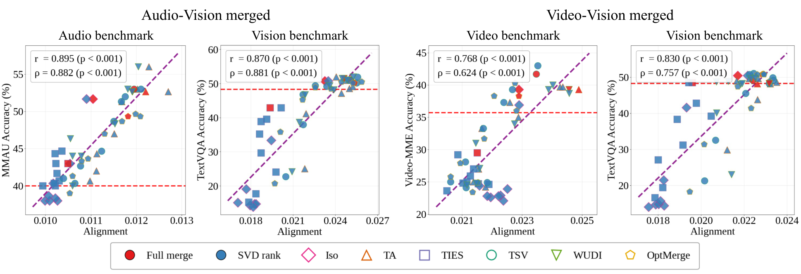
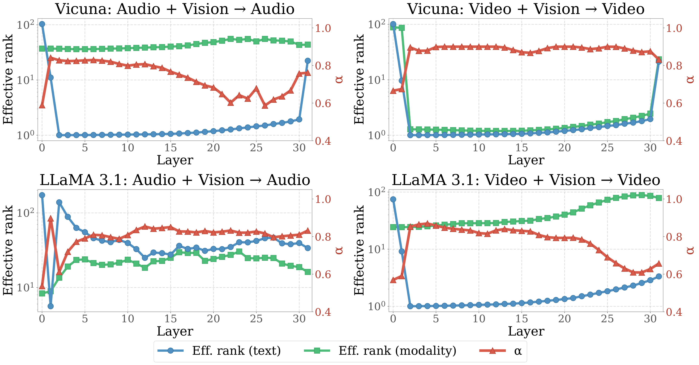
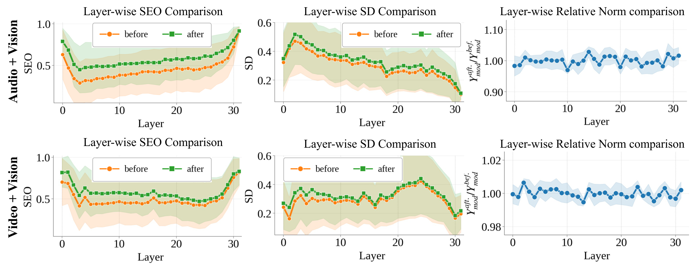

<div align="center">

# Strong Helps Weak: Directional Cross-Modal Alignment Transfer in Multi-modal LLMs

**Hoigi Seo**<sup>1\*</sup> &nbsp;&nbsp; **Byung Hyun Lee**<sup>1\*</sup> &nbsp;&nbsp; **Minjun Kim**<sup>1\*</sup> &nbsp;&nbsp; **Dohyun Mah**<sup>1</sup> &nbsp;&nbsp; **Jongho Lee**<sup>2</sup> &nbsp;&nbsp; **Se Young Chun**<sup>1,2†</sup>

<sup>1</sup>Dept. of ECE &nbsp;&nbsp; <sup>2</sup>IPAI & INMC, Seoul National University, Republic of Korea

<sub>\* Equal contribution &nbsp;&nbsp; † Corresponding author</sub>

[](https://www.python.org/)
[](https://pytorch.org/)
[](#3-method)
[](#34-the-closed-form-update)

</div>

<p align="center">
  
</p>

<p align="center">
<em><b>DCAT</b> transfers alignment from a strong, well-aligned donor-modality MLLM (vision) into a weaker
recipient-modality MLLM (audio / video), improving the recipient on its <b>own</b> benchmarks —
with no fine-tuning, no gradient steps, and only a few hundred calibration samples.</em>
</p>

---

## Table of Contents

- [1. Overview](#1-overview)
- [2. Why this works: the Alignment score](#2-why-this-works-the-alignment-score)
- [3. Method](#3-method)
  - [3.1 Notation](#31-notation)
  - [3.2 Self-alignment: the activation-space target](#32-self-alignment-the-activation-space-target)
  - [3.3 Cross-modal alignment: the donor-anchored term](#33-cross-modal-alignment-the-donor-anchored-term)
  - [3.4 The closed-form update](#34-the-closed-form-update)
  - [3.5 Scheduling α and β](#35-scheduling-α-and-β)
  - [3.6 Progressive, dependency-aware merging](#36-progressive-dependency-aware-merging)
- [4. Results](#4-results)
- [5. Repository structure](#5-repository-structure)
- [6. Installation](#6-installation)
- [7. Checkpoints and data](#7-checkpoints-and-data)
- [8. Path configuration (required)](#8-path-configuration-required)
- [9. Running a merge](#9-running-a-merge)
- [10. Hyperparameters](#10-hyperparameters)
- [11. Outputs](#11-outputs)
- [12. Loading a merged checkpoint](#12-loading-a-merged-checkpoint)
- [13. Troubleshooting](#13-troubleshooting)
- [14. Citation](#14-citation)

---

## 1. Overview

Most multi-modal LLMs pair a single modality encoder (vision, video, or audio) with a shared LLM
backbone. Improving a given modality normally means collecting more modality-specific data and
training again — expensive, and often impossible for data-scarce modalities such as audio or video.

Model merging is the cheap alternative, but it assumes you have **several same-modality variants** to
merge. For audio and video, you usually do not.

This work starts from an asymmetric observation: if you merge a **vision** MLLM into an **audio** MLLM,
the audio model gets better *at audio*. We explain why (Sec. 2), and then turn the explanation into a
method — **DCAT** — that performs the transfer deliberately instead of incidentally.

**What DCAT gives you**

| | |
|---|---|
| **Training** | None. No gradients, no optimizer, no backward pass. |
| **Data** | 256 calibration samples (AVQA), unlabeled. |
| **Solve** | One SPD linear system per projection, in closed form. |
| **Cost** | ≈ 24–35 min and ≤ 17 GB on a single L40S 48GB. |
| **Input** | A base LLM $\theta_0$, a recipient MLLM, and a donor MLLM sharing that backbone. |
| **Output** | A merged recipient checkpoint, drop-in loadable by the recipient's own framework. |

---

## 2. Why this works: the Alignment score

The gain is not magic and it is not just "more parameters". It comes from **how well modality tokens
sit inside the subspace that the LLM already uses for text**.

Let $Y_{\text{text}}$ be text-token activations and $U_k$ the top-$k$ right singular vectors of the
centered text activations — the **principal text subspace**. For modality-token activations
$Y_{\text{mod}}$ we measure two things:

**Subspace Energy Overlap (SEO)** — how much of the modality token energy lands inside that text
subspace:

$$\mathrm{SEO} \;=\; \frac{\lVert Y_{\text{mod}} P_k\rVert_F^2}{\lVert Y_{\text{mod}}\rVert_F^2},
\qquad P_k = U_k^\top U_k$$

**Spectral Diversity (SD)** — how *evenly* that energy is spread across the $k$ directions, rather
than collapsing onto one or two (effective rank, normalized):

$$\mathrm{SD} \;=\; \frac{\exp\big(-\sum_j p_j \log p_j\big)}{k},
\qquad p_j = \frac{\sigma_j^2}{\sum_i \sigma_i^2}$$

Their product is the **Alignment score**. The paper proves a mutual-information lower bound between
text and modality that is **monotonic** in this product — so pushing SEO and SD up is a principled
proxy for pushing $I(\text{text};\text{modality})$ up.

Empirically it holds across $N=114$ checkpoints spanning six merging methods and their SVD variants:

<p align="center">
  
</p>

<p align="center">
<sub>Alignment score vs. benchmark accuracy. Pearson <code>r</code> up to <b>0.895</b> (p &lt; 0.001).
Red dashed line = the original unmerged model.</sub>
</p>

The correlation is strongest from the **middle layers onward**, which is why the merge is applied
across all layers and diagnostics are reported at layer 21:

<p align="center">
  
</p>

---

## 3. Method

### 3.1 Notation

| Symbol | Meaning |
|---|---|
| $\theta_0$ | base LLM weight for one linear projection |
| $\tau_r=\theta_r-\theta_0$ | recipient task vector (e.g. the audio model) |
| $\tau_d=\theta_d-\theta_0$ | donor task vector (e.g. the vision model) |
| $X_{\text{mod}}, X_{\text{text}}$ | calibration activations entering the projection |
| $U_k$, $P_k=U_k^\top U_k$, $P_k^\perp=I-P_k$ | principal text subspace and its projectors |
| $\tau$ | the update DCAT solves for; merged weight is $\theta_0+\tau$ |

DCAT never touches the modality encoder or the projector — **only the LLM's linear projections**
(`q,k,v,o` and `gate,up,down`), layer by layer.

### 3.2 Self-alignment: the activation-space target

We build a target for the recipient's modality activations that is *deliberately* high-SEO and
high-SD. Project the recipient representation onto the text subspace, take its SVD
$X_{\text{mod}}(\theta_0+\tau_r)U_k^\top = A\,\mathrm{diag}(\sigma_j)\,B^\top$, and set
$\rho=\lVert X_{\text{mod}}(\theta_0+\tau_r)\rVert_F/\sqrt{k}$ (the isotropic radius that preserves
total energy). Then

$$T_\alpha \;=\; c_\alpha \cdot A\,\mathrm{diag}\big(\sigma_j^{\alpha}\rho^{1-\alpha}\big)_{j=1}^{k} B^\top U_k,
\qquad
c_\alpha=\frac{\lVert X_{\text{mod}}(\theta_0+\tau_r)\rVert_F}{\big(\sum_j \sigma_j^{2\alpha}\rho^{2(1-\alpha)}\big)^{1/2}}$$

$T_\alpha$ has two properties that matter:

$$T_\alpha P_k^\perp = 0 \qquad\text{and}\qquad \lVert T_\alpha\rVert_F=\lVert X_{\text{mod}}(\theta_0+\tau_r)\rVert_F$$

The first puts the target **entirely inside** the text subspace (raises SEO). The second makes it
**norm-preserving** — this is the part that stops the trivial cheat of raising the SEO *ratio* by
simply shrinking the modality activations.

$\alpha$ interpolates the spectrum: $\alpha\to1$ keeps the recipient's own singular values
(conservative), $\alpha\to0$ flattens them to isotropic (maximum SD).

Matching to this target gives a single loss that raises **both** quantities at once:

$$\mathcal{L}_{\text{self}}(\tau)=\underbrace{\lVert X_{\text{mod}}(\theta_0+\tau)P_k^\perp\rVert_F^2}_{\text{raises SEO}}+\underbrace{\lVert X_{\text{mod}}(\theta_0+\tau)P_k-T_\alpha\rVert_F^2}_{\text{raises SD}}=\lVert X_{\text{mod}}(\theta_0+\tau)-T_\alpha\rVert_F^2$$

### 3.3 Cross-modal alignment: the donor-anchored term

$\mathcal{L}_{\text{self}}$ alone leaves weight-space directions underdetermined, and nothing yet
brings in the donor. The second term anchors the solution on **text** inputs, between recipient and
donor:

$$\mathcal{L}_{\text{cross}}(\tau)=\beta\lVert X_{\text{text}}(\tau-\tau_r)\rVert_F^2+(1-\beta)\lVert X_{\text{text}}(\tau-\tau_d)\rVert_F^2$$

The **recipient anchor** preserves the recipient's existing text behaviour, so modality-specific
capability is not overwritten. The **donor anchor** is the actual transfer channel: from a linear
mode connectivity view, the donor's text-space directions mark a text-compatible region of weight
space along which alignment can be improved. The donor is *not* being averaged in — it is steering
the solution toward donor-induced, text-aligned directions.

### 3.4 The closed-form update

$$\boxed{\;\min_{\tau}\;\; \mathcal{L}_{\text{self}}(\tau)\;+\;\eta\cdot\mathcal{L}_{\text{cross}}(\tau)\;}$$

This is **quadratic in $\tau$**. Setting the gradient to zero gives one symmetric positive-definite
system per projection:

$$\tau\big(\underbrace{G_{\text{mod}}+\eta\,G_{\text{text}}}_{A,\ \text{SPD}}\big)\;=\;\underbrace{T_\alpha X_{\text{mod}}^\top-\theta_0 G_{\text{mod}}+\eta\big(\beta\tau_r+(1-\beta)\tau_d\big)G_{\text{text}}}_{B}$$

with $G_{\text{mod}}=X_{\text{mod}}^\top X_{\text{mod}}$ and $G_{\text{text}}=X_{\text{text}}^\top X_{\text{text}}$.
Solved directly with a ridge $\epsilon_{\text{solve}}=10^{-6}\cdot\mathrm{tr}(A)/d$ on the diagonal
for conditioning. No iterations, no learning rate, no early stopping.

> Implemented in `compute_tau_m_mi_surrogate()` in each `mi_surrogate_merge_eval.py`.
> The returned $\tau$ satisfies the equation above to a relative residual of $\sim10^{-6}$.

### 3.5 Scheduling α and β

Alignment differs per layer and per projection, so both knobs are scheduled **per projection** from
quantities the solver already computes:

$$\alpha=\mathrm{Sigmoid}\left(\frac{\log \mathrm{SEO}_r}{\log \mathrm{SD}_r+\epsilon}\right)
\qquad\qquad
\beta=\mathrm{Sigmoid}\left(\frac{\lVert\tilde\tau_r^\top\tilde\tau_d\rVert_F^2}{\lVert\tilde\tau_r\rVert_F^2\lVert\tilde\tau_d\rVert_F^2+\epsilon}\right)$$

$\alpha$ becomes conservative when the recipient's SEO is weak, and more isotropic when the projected
representation is spectrally concentrated. $\beta$ is driven by **TSV interference** between the
truncated recipient and donor task vectors — how much the two actually overlap.

<p align="center">
  
</p>

<p align="center">
<sub>α is scheduled inversely with text effective rank: a small text effective rank paired with a
large α would force alignment onto too few, noisy directions.</sub>
</p>

> In the four shipped configurations `--fixed-beta` is passed, pinning β to the paper's value while α
> stays auto-scheduled. Drop the flag to enable the β schedule above; add `--fixed-alpha` to pin α.

### 3.6 Progressive, dependency-aware merging

$T_\alpha$ is built from **pre-update** activations. Solving every layer against the original model
and applying them all at once would therefore accumulate drift. DCAT instead walks layers
$0\rightarrow31$, applies each layer's solution immediately, and **recomputes calibration activations
through the partially merged model** before moving on.

Within a layer, projections that share an input are solved as a group
(`q,k,v` together; `o`; `gate,up` together; `down`) so their inputs stay mutually consistent.

### Does it actually raise SEO and SD?

<p align="center">
  
</p>

<p align="center">
<sub>SEO and SD both rise significantly (p &lt; 0.05) while the modality-token norm ratio stays ≈ 1.0 —
the objective behaves exactly as designed, and the gain is not norm shrinkage.</sub>
</p>

---

## 4. Results

DCAT is compared against Task Arithmetic (TA), TIES, ISO-C, TSV, WUDI and OptMerge. For LLaMA 3.1,
baselines are additionally reported at their best merging coefficient $\lambda=0.2$, since the default
$\lambda=1.0$ degrades them.

**Audio + Vision** (vision donor → audio recipient)

| Backbone | Method | MMAU | AIR-Bench | MuCho | Clotho | Vocal | **Avg** |
|---|---|:--:|:--:|:--:|:--:|:--:|:--:|
| Vicuna-7B | Original | 48.90 | 43.17 | 26.96 | 61.23 | 48.98 | 45.85 |
| Vicuna-7B | TSV | 52.70 | 50.51 | 50.80 | 81.21 | 47.54 | 56.55 |
| Vicuna-7B | OptMerge | 53.10 | 50.50 | 50.21 | 80.24 | 49.07 | 56.62 |
| Vicuna-7B | **DCAT** | **56.20** | **52.44** | **54.17** | **82.96** | **51.25** | **59.40** |
| LLaMA 3.1-8B | Original | 55.50 | 42.86 | 52.57 | 55.48 | 31.02 | 47.49 |
| LLaMA 3.1-8B | best baseline | 57.60 | 43.50 | 55.94 | 58.67 | 31.22 | 48.66 |
| LLaMA 3.1-8B | **DCAT** | **59.16** | **44.93** | **58.30** | **61.56** | **31.94** | **51.18** |

**Video + Vision** (vision donor → video recipient)

| Backbone | Method | Video-MME | TempCompass | MVBench | MLVU | **Avg** |
|---|---|:--:|:--:|:--:|:--:|:--:|
| Vicuna-7B | Original | 35.00 | 55.46 | 38.48 | 32.59 | 40.38 |
| Vicuna-7B | TSV | 39.04 | 57.24 | 44.58 | 45.18 | 46.51 |
| Vicuna-7B | **DCAT** | **41.53** | **59.71** | **47.65** | **46.34** | **48.81** |
| LLaMA 3.1-8B | Original | 38.19 | 51.28 | 41.00 | 31.79 | 40.57 |
| LLaMA 3.1-8B | best baseline | 42.93 | 58.44 | 47.23 | 49.24 | 48.43 |
| LLaMA 3.1-8B | **DCAT** | **44.44** | **59.88** | **51.18** | **50.15** | **51.41** |

Headline relative gains over the original recipient: **+7.62%** on MMAU, **+100.92%** on MuCho-Music,
**+16.37%** on Video-MME, **+23.83%** on MVBench. Averaged: **+29.55%** audio, **+24.92%** video.

**Cost** (single NVIDIA L40S 48GB, core merge only)

| Setting | Merge time | Peak memory |
|---|:--:|:--:|
| Vicuna + Audio / Video | ~24–25 min | 14.56 GB |
| LLaMA 3.1 + Audio | 28.45 min | 16.72 GB |
| LLaMA 3.1 + Video | 34.57 min | 16.72 GB |

---

## 5. Repository structure

```
.
├── merge_vicuna_vision_to_audio/       Vicuna-7B    vision → audio   (eval: MMAU)
│   ├── run_merge.sh                     entry point; paths + hyperparameters
│   ├── mi_surrogate_merge_eval.py       calibration, DCAT solve, merge, eval
│   └── preload_modal_cache.py           one-time audio decode into RAM
│
├── merge_vicuna_vision_to_video/       Vicuna-7B    vision → video   (eval: Video-MME)
│   ├── run_merge.sh
│   ├── mi_surrogate_merge_eval.py
│   └── preload_modal_cache.py
│
├── merge_llama_3_1_vision_to_audio/    LLaMA 3.1-8B vision → audio   (eval: MMAU)
│   ├── run_merge.sh
│   └── mi_surrogate_merge_eval.py
│
├── merge_llama_3_1_vision_to_video/    LLaMA 3.1-8B vision → video   (eval: Video-MME)
│   ├── run_merge.sh
│   └── mi_surrogate_merge_eval.py
│
├── requirements_vicuna.txt
├── requirements_llama.txt
└── assets/
```

Each directory is **self-contained** — one `cd` and one `bash run_merge.sh`.

**Where to look inside `mi_surrogate_merge_eval.py`**

| Function | What it does |
|---|---|
| `compute_tau_m_mi_surrogate` | the whole DCAT solve: $T_\alpha$, α/β schedules, SPD solve, diagnostics |
| `stack_features_for_layer` | collects $X_{\text{mod}}$ / $X_{\text{text}}$ for one layer |
| `propagate_through_layer` | pushes activations through the just-merged layer (progressive merging) |
| `resolve_proj_paths` / `split_into_dependency_groups` | which projections, in which dependency groups |
| `compute_proj_energy_div_mixed` | the Alignment score (SEO × SD) used for diagnostics |
| `measure_alignment_layer21` | alignment probe reported before/after |
| `run_full_evaluation` | MMAU / Video-MME accuracy |

---

## 6. Installation

Two environments are needed: Vicuna models run on the **ModelCompose** stack (torch 2.0 /
transformers 4.45), LLaMA 3.1 models on **LLaVA-NeXT + Ultravox** (torch 2.7 / transformers 4.55).
They are not co-installable.

**Vicuna**

```bash
conda create -n dcat_vicuna python=3.10 -y
conda activate dcat_vicuna
pip install -r requirements_vicuna.txt

# ModelCompose (provides `modelcompose`, required by the Vicuna scripts)
git clone https://github.com/WalkerWorldPeace/MLLMerging.git
cd MLLMerging/ModelCompose && pip install -e . && cd -
```

**LLaMA 3.1**

```bash
conda create -n dcat_llama python=3.10 -y
conda activate dcat_llama
pip install -r requirements_llama.txt

# LLaVA-NeXT (provides `llava`, required by the LLaMA scripts)
pip install git+https://github.com/LLaVA-VL/LLaVA-NeXT.git
```

Ultravox (the LLaMA audio recipient) is loaded through
`transformers.pipeline(..., trust_remote_code=True)` and needs no separate install.

| Backbone | Env name | Requirements | Key frameworks |
|---|---|---|---|
| Vicuna-7B-v1.5 | `dcat_vicuna` | `requirements_vicuna.txt` | ModelCompose, torch 2.0.1, transformers 4.45.2 |
| LLaMA-3.1-8B-Instruct | `dcat_llama` | `requirements_llama.txt` | LLaVA-NeXT, torch 2.7, transformers 4.55 |

**Hardware.** One GPU with ≥ 24 GB VRAM (L40S 48GB used for all reported numbers). Merging peaks at
≤ 17 GB; the rest of the headroom is for evaluation. `/dev/shm` should have room for the staged
benchmark data.

---

## 7. Checkpoints and data

**Vicuna family** (weights released by OptMerge; all four share `vicuna-7b-v1.5`):

```
<CKPT_ROOT>/
├── vicuna-7b-v1.5/                             base LLM  θ₀
├── multimodal-vicuna-7b-v1.5-audio-naivemc/    audio  recipient
├── multimodal-vicuna-7b-v1.5-video-naivemc/    video  recipient
└── multimodal-vicuna-7b-v1.5-vision-naivemc/   vision donor
```

**LLaMA 3.1 family** (independently trained in-the-wild models sharing the same backbone — this is
the harder, more realistic setting):

```
<CKPT_ROOT>/
├── llama3.1-8b-instruct/              base LLM  θ₀
├── ultravox_v0_4_1_llama_3_1_8b/      audio  recipient (Ultravox)
├── llava-video-llama-3.1-8b/          video  recipient (LLaVA-Video)
└── llava-llama3.1-8b/                 vision donor     (LLaVA-NeXT)
```

**Data**

| Dataset | Role | Used by | Expected layout |
|---|---|---|---|
| [AVQA](https://mn.cs.tsinghua.edu.cn/avqa/) <sub>(Yang et al., ACM MM'22)</sub> | calibration (256 samples) | all four | `<DATA>/AVQA_MUSIC-AVQA_supp/data/test/avqa-test_mm_video.json` |
| [MMAU](https://sakshi113.github.io/mmau_homepage/) <sub>(ICLR'25)</sub> | evaluation | audio runs | `<DATA>/mmau/test_mini.json` |
| [Video-MME](https://video-mme.github.io/) <sub>(CVPR'25)</sub> | evaluation | video runs | `<DATA>/videomme/videomme_test_flat.json` + `videos/data/*.mp4` |

The audio track of AVQA calibrates audio recipients and the video track calibrates video recipients —
one dataset covers all four settings. `run_merge.sh` stages this data into `/dev/shm` automatically on
first run and reuses it afterwards.

---

## 8. Path configuration (required)

All absolute paths are shipped as the placeholder `xxx/xxx`. **Nothing will run until you replace
them.** There are exactly four things to set:

| Placeholder | Where | Set it to |
|---|---|---|
| `xxx/xxx/{vicuna,llama}_models/checkpoints` | `run_merge.sh` (`CKPT=`) | your checkpoint root |
| `xxx/xxx/data/...` | `run_merge.sh` (`MMAU_SRC`, `AVQA_SRC`, `VIDEOMME_SRC`) | your dataset roots |
| `xxx_conda_env` | `run_merge.sh` (`CONDA_ENV=`) | `dcat_vicuna` or `dcat_llama` |
| `xxx/xxx/data/AVQA/constructed_avqa/videos/test` | `mi_surrogate_merge_eval.py` (`AVQA_VIDEO_CONSTRUCTED_DIR`), `preload_modal_cache.py` (`DEFAULT_MODEL_BASE`) | AVQA video root / base LLM |

One-shot replacement:

```bash
ROOT=/your/actual/root          # parent of the checkpoint and data directories

find . -type f \( -name '*.sh' -o -name '*.py' \) -exec sed -i "s|xxx/xxx|$ROOT|g" {} +

# conda env name, per family
sed -i 's|xxx_conda_env|dcat_vicuna|g' merge_vicuna_*/run_merge.sh
sed -i 's|xxx_conda_env|dcat_llama|g'  merge_llama_*/run_merge.sh
```

Verify nothing was missed:

```bash
grep -rn 'xxx' --include='*.sh' --include='*.py' .   # should print nothing
```

Data roots can also be overridden per-run without editing files:

```bash
MMAU_SRC=/data/mmau AVQA_SRC=/data/avqa/data CONDA_ENV=dcat_vicuna bash run_merge.sh
```

---

## 9. Running a merge

```bash
cd merge_vicuna_vision_to_audio
bash run_merge.sh
```

Pick the GPU with the `GPU` variable (default `0`):

```bash
GPU=3 bash run_merge.sh
```

What the script does, in order:

1. Stage AVQA + the evaluation benchmark into `/dev/shm` (first run only).
2. *(Vicuna only)* Decode audio/video once into a RAM tensor cache, so evaluation never re-decodes.
3. Load the recipient model and collect 256 calibration activations.
4. Walk layers 0 → 31; at each layer solve DCAT for all 7 projections in dependency groups, apply
   immediately, and re-propagate activations.
5. Save the merged checkpoint.
6. Evaluate and append a row to `experiment_results.csv`.

The four settings:

| Directory | Donor → Recipient | Calibration | Evaluation | Pre-merge eval | Runtime |
|---|---|---|---|---|---|
| `merge_vicuna_vision_to_audio` | vision → audio | AVQA (audio) | MMAU, 1000 | skipped | ~25 min |
| `merge_vicuna_vision_to_video` | vision → video | AVQA (video) | Video-MME, 1800 (seed 77) | skipped | ~25 min |
| `merge_llama_3_1_vision_to_audio` | vision → audio | AVQA (audio) | MMAU, 1000 | **run** | ~28 min + eval |
| `merge_llama_3_1_vision_to_video` | vision → video | AVQA (video) | Video-MME, 900 (seed 77) | skipped | ~35 min |

> The pre-merge ("before") evaluation is controlled by `SKIP_BEFORE_FLAG` at the top of each script.
> It is skipped in three of the four settings because it doubles wall-clock time; set
> `SKIP_BEFORE_FLAG=""` to get a before/after pair in one run. Alignment is measured either way.

**Long runs.** Always launch detached runs with `PYTHONBREAKPOINT=0` (already exported inside the
scripts) so nothing can drop into `pdb` on a closed stdin:

```bash
nohup bash run_merge.sh > logs/run.log 2>&1 &
tail -f logs/run.log
```

**Running two settings at once.** The Vicuna scripts share `/dev/shm/modal_cache` by default; the
audio run wants `audio.pt` and the video run wants `video.pt`, so whichever starts second will treat
the cache as stale and wipe it. Give each its own:

```bash
GPU=0 MODAL_CACHE_DIR=/dev/shm/cache_audio bash merge_vicuna_vision_to_audio/run_merge.sh &
GPU=1 MODAL_CACHE_DIR=/dev/shm/cache_video bash merge_vicuna_vision_to_video/run_merge.sh &
```

---

## 10. Hyperparameters

Edit the block at the top of `run_merge.sh`.

| Symbol | Flag | Meaning | Effect of increasing |
|---|---|---|---|
| $\eta$ | `--eta` | weight of $\mathcal{L}_{\text{cross}}$ in $A=G_{\text{mod}}+\eta G_{\text{text}}$ | more text/donor anchoring, less aggressive realignment |
| $k$ | `--top-p` | text subspace dimension | wider text subspace; scale with hidden width |
| $\alpha$ | `--alpha` | spectrum interpolation for $T_\alpha$ | auto-scheduled; `--fixed-alpha` pins it |
| $\beta$ | `--beta` | recipient vs donor anchor weight | higher = stay closer to the recipient |
| — | `--num-samples` | calibration samples | 256 is the paper setting |
| — | `--start-layer` / `--end-layer` | layer range | full `0–31` in all settings |
| — | `--proj-groups` | `all` / `attn_full` / `mlp_full` | which projections to merge |
| — | `--eps-solve` | ridge on the SPD solve | numerical conditioning only |

**The four shipped configurations** (identical to the paper):

| | Vicuna + Audio | Vicuna + Video | LLaMA + Audio | LLaMA + Video |
|---|:--:|:--:|:--:|:--:|
| Backbone | Vicuna-7B-v1.5 | Vicuna-7B-v1.5 | LLaMA-3.1-8B-Instruct | LLaMA-3.1-8B-Instruct |
| Calibration | AVQA (audio) | AVQA (video) | AVQA (audio) | AVQA (video) |
| # calibration samples | 256 | 256 | 256 | 256 |
| $k$ | 128 | 128 | 256 | 256 |
| $\beta$ (fixed) | 0.30 | 0.30 | 0.95 | 0.95 |
| $\eta$ | $1\times10^{5}$ | $1\times10^{5}$ | $1\times10^{6}$ | $1\times10^{6}$ |
| Layers | 0–31 | 0–31 | 0–31 | 0–31 |

$k$ is shared within a backbone family: LLaMA-3.1's hidden states are wider and need a larger
effective rank to span the principal text directions, hence 256 vs 128.

---

## 11. Outputs

```
merge_vicuna_vision_to_audio/
├── logs/
│   ├── merged_ckpt/<config_tag>/
│   │   ├── adapter_model.bin        merged weights  (Vicuna — hybrid adapter)
│   │   │   or model-*.safetensors   merged weights  (LLaMA — full weights)
│   │   ├── config.json
│   │   └── dcat_merge_log.txt       per-layer, per-projection merge log
│   └── preload_modal_cache.log
├── results/
│   ├── <config_tag>_before.json     pre-merge accuracy + subcategory breakdown
│   ├── <config_tag>_after.json      post-merge
│   └── <config_tag>_comparison.json before/after side by side
└── experiment_results.csv           one row appended per run
```

`<config_tag>` encodes the configuration, e.g. `DCAT_eta1e5_k128_b0.3_L0-31_all`.

The per-projection diagnostics recorded during the merge include `SEO_before/after`,
`SD_before/after`, `alpha`, `beta`, `alpha_auto`, `beta_auto`, `Ym_over_Yr` (the modality-token norm
ratio, expected ≈ 1.0) and `weight_relative_change` — these are what Fig. *SEO/SD before–after* is
built from.

Quick check once a run finishes:

```bash
tail -1 experiment_results.csv
python -c "import json;d=json.load(open('results/<tag>_comparison.json'));print(d)"
```

---

## 12. Loading a merged checkpoint

### Vicuna (ModelCompose)

```python
import torch
from modelcompose.model.builder import load_pretrained_model
from modelcompose.mm_utils import get_model_name_from_path

merged = "merge_vicuna_vision_to_audio/logs/merged_ckpt/DCAT_eta1e5_k128_b0.3_L0-31_all"
base   = "<CKPT_ROOT>/vicuna-7b-v1.5"

tokenizer, model, modal_processors, _ = load_pretrained_model(
    merged, base, get_model_name_from_path(merged)
)
model.eval().cuda()
```

Audio inference:

```python
from modelcompose.conversation import conv_templates
from modelcompose.mm_utils import tokenizer_modal_token
from modelcompose.constants import MODAL_TOKENS

conv = conv_templates["vicuna_v1"].copy()
conv.append_message(conv.roles[0], f"{MODAL_TOKENS['audio']}\n{question}")
conv.append_message(conv.roles[1], None)

input_ids = tokenizer_modal_token(
    conv.get_prompt(), tokenizer, return_tensors="pt"
).unsqueeze(0).cuda()

feats, mask = modal_processors["audio"]([audio_path])
modal_inputs = {"audio": {
    "audio_inputs":       feats.cuda().to(model.dtype),
    "audio_padding_mask": mask.cuda().to(model.dtype),
}}

with torch.inference_mode():
    out = model.generate(input_ids, modal_inputs=modal_inputs,
                         do_sample=False, max_new_tokens=128, use_cache=True)
print(tokenizer.batch_decode(out[:, input_ids.shape[1]:], skip_special_tokens=True)[0].strip())
```

Video inference is identical with `MODAL_TOKENS['video']` and
`modal_inputs = {"video": video_proc(path)["pixel_values"].unsqueeze(0).cuda().to(model.dtype)}`.

### LLaMA 3.1 — audio (Ultravox)

```python
import torch, transformers

pipe = transformers.pipeline(
    model="merge_llama_3_1_vision_to_audio/logs/merged_ckpt/<config_tag>",
    trust_remote_code=True, device="cuda", torch_dtype=torch.bfloat16,
)
print(pipe({"audio": audio_path,
            "turns": [{"role": "user", "content": question}]},
           max_new_tokens=128))
```

### LLaMA 3.1 — video (LLaVA-NeXT)

```python
import numpy as np, torch
from PIL import Image
from decord import VideoReader, cpu
from llava.model.builder import load_pretrained_model
from llava.mm_utils import tokenizer_image_token
from llava.constants import IMAGE_TOKEN_INDEX, DEFAULT_IMAGE_TOKEN

tokenizer, model, image_processor, _ = load_pretrained_model(
    "merge_llama_3_1_vision_to_video/logs/merged_ckpt/<config_tag>",
    "<CKPT_ROOT>/llama3.1-8b-instruct", "llava-merged",
)

vr     = VideoReader(video_path, ctx=cpu(0))
frames = [Image.fromarray(f) for f in
          vr.get_batch(np.linspace(0, len(vr) - 1, 16, dtype=int).tolist()).asnumpy()]
images = image_processor.preprocess(frames, return_tensors="pt")["pixel_values"].cuda().to(torch.bfloat16)

input_ids = tokenizer_image_token(f"{DEFAULT_IMAGE_TOKEN}\n{question}", tokenizer,
                                  IMAGE_TOKEN_INDEX, return_tensors="pt").unsqueeze(0).cuda()

with torch.inference_mode():
    out = model.generate(input_ids, images=[images], image_sizes=[frames[0].size],
                         modalities=["video"], do_sample=False, max_new_tokens=64)
print(tokenizer.batch_decode(out, skip_special_tokens=True)[0].strip())
```

---

## 13. Troubleshooting

| Symptom | Cause / fix |
|---|---|
| `✗ MMAU source not found` / `✗ AVQA source not found` | `xxx/xxx` placeholders not replaced, or wrong dataset layout. See [§8](#8-path-configuration-required). |
| Background run hangs with no output | a `breakpoint()` reached `pdb` on a closed stdin. Launch with `PYTHONBREAKPOINT=0` (the scripts export it; keep it if you wrap them). |
| Two runs keep wiping each other's cache | both defaulted to `/dev/shm/modal_cache`. Give each a distinct `MODAL_CACHE_DIR`. |
| `⚠ Preload failed (no audio.pt/video.pt)` | not fatal — evaluation falls back to per-sample decoding, just slower. Usually a missing media file under the staged root. |
| `Stale modal cache (READY without …)` | the cache belongs to the other modality. It is cleared and rebuilt automatically. |
| `ModuleNotFoundError: modelcompose` / `llava` | wrong conda env, or the framework was not installed from source. See [§6](#6-installation). |
| CUDA OOM during evaluation | lower `MMAU_EVAL` / `VME_EVAL`, or run merge and evaluation as separate passes. |
| Merged model looks unchanged | check `weight_relative_change` in the merge log — if ≈ 0, η is likely far too large for your activation scale. |

> `--videomme-num-eval` appears only in a summary log line. The flag that actually controls the
> Video-MME evaluation size is `--num-eval-samples` (`VME_EVAL` in the script).

---

## 14. Citation

```bibtex
@inproceedings{seo2026dcat,
  title     = {Strong Helps Weak: Directional Cross-Modal Alignment Transfer in Multi-modal LLMs},
  author    = {Seo, Hoigi and Lee, Byung Hyun and Kim, Minjun and
               Mah, Dohyun and Lee, Jongho and Chun, Se Young},
  booktitle = {Advances in Neural Information Processing Systems (NeurIPS)},
  year      = {2026}
}
```

## Acknowledgements

Built on [ModelCompose / MLLMerging](https://github.com/WalkerWorldPeace/MLLMerging) for the Vicuna
multimodal stack and [LLaVA-NeXT](https://github.com/LLaVA-VL/LLaVA-NeXT) for the LLaMA 3.1 stack.
Vicuna checkpoints follow the release of [OptMerge](https://github.com/EnnengYang/OptMerge). We thank
the authors of MMAU, AIR-Bench, MuChoMusic, Clotho-AQA, VocalSound, Video-MME, TempCompass, MVBench
and MLVU for their benchmarks, and the maintainers of Task Arithmetic, TIES, ISO-C, TSV, WUDI and
OptMerge, which we compare against.
